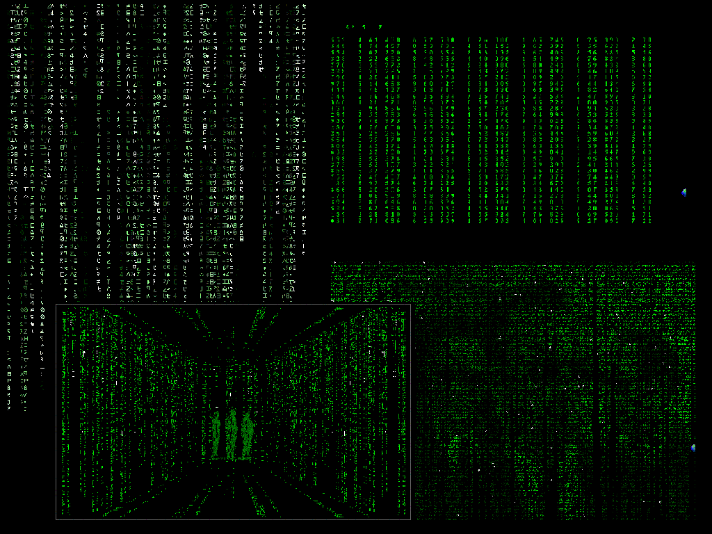



## Matrix Screensaver Collection

### Description

This is the ultimate Matrix Screensaver collection, it has loads of features that Matrix fans can't live without. It has the normal falling code, with options of Size, Colour, Speed... and the option to make it look like the code from Reloaded. It can give the effect of a picture in the falling code if you import one in. And Now it can create the same effect but continous from an AVI File!! Good example to learn MCI from. It also has the call tracing effect and the computer screen moment from the first film 'Knock Knock Neo...' Also in development is the Hallway effect, as seen in the end of the first film, the code is place to give the affect of the code going down the walls, Cool! But still in Very! early stages. Well theres that and much More... Enjoy <Updated 3rd May - No longer the need to end the task to stop the hallway effect, improved the hallway effect & No more flickering, Did the trick to the command buttons that was suggested and other slight improvements>
 
### More Info
 

             |
---                |---
**Submitted On**   |2003-05-03 16:06:32
**By**             |[Kevin Pfister](https://github.com/Planet-Source-Code/PSCIndex/blob/master/ByAuthor/kevin-pfister.md)
**Level**          |Intermediate
**User Rating**    |4.6 (69 globes from 15 users)
**Compatibility**  |VB 6\.0
**Category**       |[Graphics](https://github.com/Planet-Source-Code/PSCIndex/blob/master/ByCategory/graphics__1-46.md)
**World**          |[Visual Basic](https://github.com/Planet-Source-Code/PSCIndex/blob/master/ByWorld/visual-basic.md)
**Archive File**   |[Matrix\_Scr158274532003\.zip](https://github.com/Planet-Source-Code/kevin-pfister-matrix-screensaver-collection__1-45161/archive/master.zip)

